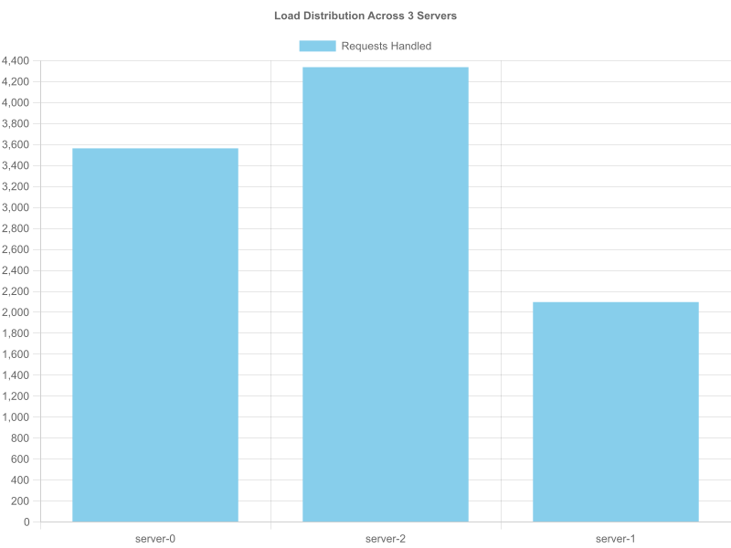
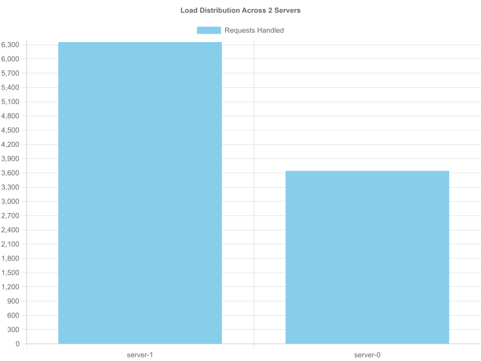
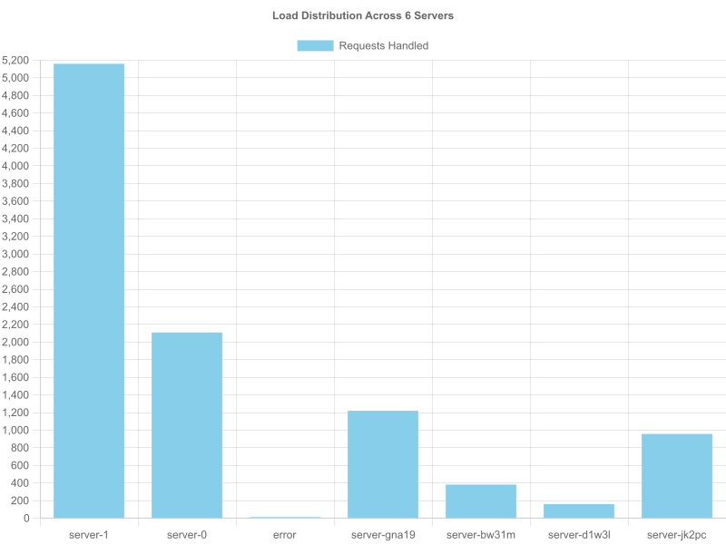

<p align="center">
  
  
  
</p>

# Customizable Load Balancer in Docker

This project is an implementation of a customizable, fault-tolerant load balancer within a Docker environment. The system is designed to distribute asynchronous client requests evenly among a dynamic pool of web server replicas. The core of the load balancer uses a consistent hashing algorithm to efficiently map requests to servers, ensuring high availability and resource utilization.

---

## Table of Contents

1.  [Features](#features)
2.  [System Diagram](#system-diagram)
3.  [Prerequisites](#prerequisites)
4.  [Getting Started](#getting-started)
5.  [API Endpoints](#api-endpoints)
6.  [Design Choices and Assumptions](#design-choices-and-assumptions)
7.  [Testing and Performance Analysis](#testing-and-performance-analysis)

---

## Features

- **Dynamic Scaling**: Add or remove server instances via API endpoints to scale with client demand.
- **Fault Tolerance**: Automatically detects server failures and spawns new replicas to maintain the desired number of instances (`N`).
- **Consistent Hashing**: Utilizes a custom-built consistent hash map with virtual servers to ensure even load distribution and minimal disruption when servers are added or removed.
- **Dockerized Environment**: The entire system (load balancer and servers) is containerized and runs within an isolated Docker network (`net1`).
- **State Recovery**: The load balancer can recover its state by inspecting running Docker containers on startup, making it resilient to crashes.

---

## System Diagram

The system consists of a load balancer that manages `N` server instances. The load balancer is the single entry point for all clients and distributes incoming requests to the available servers. It also monitors the health of servers and spawns new ones in case of failure.


---

## Prerequisites

- **OS**: Ubuntu 20.04 LTS
- **Docker**: Version 20.10.23 or above
- **Docker Compose**: Standalone version v2.15.1 or above
- **Node.js**: Version 18.x or above (for running tests)

---

## Getting Started

### Installation

1.  Clone the repository to your local machine:

    ```bash
    git clone [https://github.com/dave-manufor/ds-project.git](https://github.com/dave-manufor/ds-project.git)
    ```

2.  Build the Docker images for the load balancer and the web server using the provided Makefile:

    ```bash
    make buil
    ```

3.  Once the images are built, start the entire stack in detached mode:

    ```bash
    make up
    ```

    This command will also create the required Docker network (`net1`) and start the load balancer, which in turn will spawn the initial `N=3` server replicas.

4.  To check the logs of the running containers:

    ```bash
    make logs
    ```

5.  To stop and remove all containers and the network:
    ```bash
    make down
    ```

---

## API Endpoints

The load balancer is exposed on `http://localhost:5000`.

| Endpoint  | Method   | Description                                                                                                                                       |
| :-------- | :------- | :------------------------------------------------------------------------------------------------------------------------------------------------ |
| `/rep`    | `GET`    | Returns the hostnames of the current server replicas and their count (`N`).                                                                       |
| `/add`    | `POST`   | Adds new server instances. Expects a JSON payload: `{ "n": 2, "hostnames": ["S1", "S2"] }`.                                                       |
| `/rm`     | `DELETE` | Removes server instances. Expects a JSON payload: `{ "n": 2, "hostnames": ["S1", "S2"] }`. If hostnames are insufficient, random ones are chosen. |
| `/home`   | `GET`    | Forwards the request to one of the server replicas based on the consistent hashing algorithm. Returns a message like `Hello from Server: <ID>`.   |
| `/<path>` | `GET`    | Any other GET path will result in a `400 Bad Request` error, as only the `/home` endpoint is implemented on the servers.                          |

---

## Design Choices and Assumptions

- **Language and Framework**: The project is built with **Node.js** and **Express.js**. This stack is well-suited for I/O-bound applications like a load balancer due to its asynchronous, non-blocking nature.
- **Docker Interaction**: The load balancer runs in a **privileged container** and mounts the host's Docker socket (`/var/run/docker.sock`). This "Docker-in-Docker" approach allows the load balancer to manage sibling containers (spawning, removing, and inspecting them) using the `dockerode` library.
- **Consistent Hashing**:
  - A `GlobalHashMap` class implements the consistent hashing logic. It uses a Singleton pattern to ensure a single state across the application.
  - It supports **virtual servers** (`K=9`) to improve load distribution, especially after server additions or failures.
  - **Collision Resolution**: If two virtual servers hash to the same slot, **linear probing** is used to find the next available slot.
- **Fault Tolerance**:
  - The load balancer performs periodic health checks every 20 seconds by sending a `GET` request to the `/heartbeat` endpoint of each server.
  - If a server fails to respond, it is removed from the hash map and the Docker environment. A new server with the **same hostname** is spawned to replace it, ensuring `N` is maintained.
- **State Management**:
  - On startup, the `recoverState` function queries the Docker daemon for any existing containers managed by it (identified by Docker labels). This allows the load balancer to rebuild its hash map and resume operation without losing track of existing replicas if it crashes and restarts.
  - The number of server replicas to maintain (`N`) is dynamically tracked based on the `add` and `rm` operations. The initial count is 3.
- **Server Identification**: A server's unique ID for the hashing algorithm is deterministically generated by creating an MD5 hash of its hostname.

---

## Testing and Performance Analysis

The performance of the load balancer was evaluated based on the criteria in the assignment. The following tests were conducted by running `make test-a1`, `make test-a2`, etc.

### A-1: Load Distribution (N=3)

We launched 10,000 asynchronous requests to the `/home` endpoint with `N=3` server replicas. The bar chart below shows the number of requests handled by each server.

**Observation**: The requests are distributed relatively evenly among the three servers, with minor variations. This demonstrates that the consistent hashing algorithm is effective at balancing the load.



### A-2: Scalability Analysis

We tested the system's scalability by varying the number of server replicas (`N`) from 2 to 6 and sending 10,000 requests for each configuration.

**Observation**: As `N` increases, the average load per server decreases. The distribution remains even across different values of `N`, indicating that the load balancer scales effectively and adapts well to changes in the number of replicas.






### A-3: Endpoint and Fault Tolerance Testing

This test manually verifies the functionality of all API endpoints and the fault tolerance mechanism. The detailed steps and expected outcomes are documented in [tests/A3.md](./tests/A3.md). The tests confirmed that:

- `GET /rep`, `POST /add`, and `DELETE /rm` work as expected.
- The load balancer successfully detects a failed (manually stopped) server and spawns a new one to replace it.

### A-4: Analysis with Modified Hash Functions

The A-1 and A-2 tests were repeated using a different set of hash functions (MD5-based) for both request mapping and server placement.

**Observation**: The modified hash functions also resulted in an even distribution of load, similar to the default functions. This suggests that the underlying consistent hashing logic is robust. The MD5 hash is generally expected to provide a more uniform distribution and reduce collisions compared to simpler polynomial functions.

**A-1 with Custom Hash (N=3)**


**A-2 with Custom Hash (N=2 to N=6)**


## Group Members
#### David Manufor 148326
#### Ruth Ogoro 145515
#### Nyakio Ndambiri 152136
#### Daryn Ongera 150490
